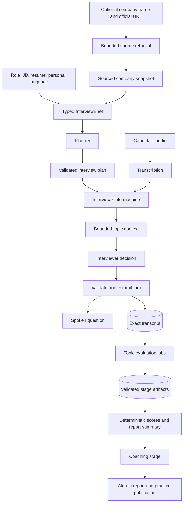

# Agent architecture review

Reviewed 2026-09-20. The findings below describe the pre-change baseline. The subsequent implementation
adds checkpointed reports, classified retries, bounded context, immutable execution snapshots, evidence
validation, shared language preferences, correlated traces and company web research. See AGENT_RUNTIME.md
and COMPANY_RESEARCH.md for current behavior and explicit remaining limitations (including quota units
and live quality calibration).

## Assessment

Keep the explicit bounded workflow. Services own authorization, interview transitions, leases,
idempotency and persistence; agents return validated proposals. Provider adapters and individual
prompt files make this understandable for coding agents. Persona snapshots, exact-quote checks,
and deterministic score aggregation are useful foundations.

The immediate priorities are recoverable report stages, predictable inference budgets and stronger
artifact contracts. Additional autonomous agents or a new orchestration framework would not, by
themselves, solve the failures below.

## Findings, in implementation order

### 1. High: successful evaluation is lost when coaching fails

Location: `backend/app/services/reports.py:66–111`.

The evaluator and coach execute sequentially, and neither artifact is saved until both succeed.
Every job retry starts evaluation again. A fixture reproduction made evaluation succeed and coaching
fail: three worker attempts produced three evaluations and six coach calls, ending in `report_failed`
with no saved report. This wastes inference, can change scores between retries and couples feedback
availability to drill generation.

Persist private, validated stage artifacts with input hashes and fenced writes. Resume at the first
incomplete stage. This can preserve the existing atomic report-plus-task publication contract.
Publishing a completed report while coaching remains pending is a separate product/API decision.
For long interviews, evaluate bounded topic groups, then aggregate their validated results.

Acceptance: a coach retry or worker restart does not repeat completed evaluation; stale leases cannot
publish; duplicate deliveries cannot create duplicate tasks; only validated artifacts are reused.

### 2. High: one retry policy handles every role and error

Locations: `backend/app/agents/runtime.py:43–63`, `backend/app/services/reports.py:112–125`,
`backend/app/providers/sarvam.py:16–32`.

The runtime catches every exception and immediately retries or switches to the fallback. Existing
tests confirm that a 403 receives two calls. Malformed-output retries receive the original input
without corrective validation feedback. The worker retries all failure classes, including permanent
contract/configuration errors and exhausted quotas. The live conversation and batch report use the
same provider timeout, while Sarvam assigns the same 8,192 output-token ceiling to every role.

Introduce typed error categories: transient, rate-limited, invalid output, unavailable configuration,
budget exhausted and permanent request failure. Add role-specific execution policies for total
deadline, output budget, retry count and permitted fallback. Honor retry timing for rate limits;
avoid sleeping through the live conversation's entire latency budget. Pass safe field paths and
validation codes into a bounded repair attempt, excluding raw provider errors and input values.
Enforce a workflow deadline that fits the lease, with cancellation or lease renewal where needed.

Acceptance: permanent failures do not repeat the identical call; transient retries stay within the
deadline; repair attempts receive useful feedback; job status distinguishes operator action from
a user-retryable outage. Preserve the rule that live calls cannot fall back to test fixtures.

### 3. High: context handling fails abruptly and penalizes non-Latin text

Locations: `backend/app/agents/runtime.py:31–34`, `backend/app/services/interviews.py:173–187`,
`backend/app/services/reports.py:56–76`.

Every turn resends the entire conversation; report generation resends all answered turns. The only
application guard measures the length of `json.dumps(payload)` against 180,000 characters. Default
ASCII escaping expands many non-Latin characters into six-character sequences. A 31,000-character
Devanagari input was rejected before inference despite the resume upload's 60,000-character limit.
For large sessions, the guard advises finishing even though report generation uses the same guard.

Add a shared context builder with conservative, model-aware token budgeting and output headroom.
Retain exact transcripts as the source of truth. Supply the live interviewer the current topic,
recent turns, relevant resume claims and a bounded coverage summary. Evaluate reports by topic,
using original answers for evidence validation; do not replace evidence with model summaries.
Use Unicode-preserving serialization where appropriate, but do not treat that alone as token budgeting.

Acceptance: representative English, Hindi and mixed-language inputs receive consistent capacity
handling; long sessions still finish and produce reports; no silent truncation of quoted evidence.

### 4. Medium: model and prompt behavior is not fully snapshotted

Locations: `backend/app/services/interviews.py:73–89`, `backend/app/providers/base.py:47–60`,
`backend/app/agents/runtime.py:35–42`.

Interviews save profile IDs; each invocation resolves those IDs against current TOML/environment
values and reads the current prompt file. Editing a profile's model or a prompt changes an existing
interview. The persona definition is already snapshotted correctly. A fixture reproduction confirmed
that a saved profile ID picked up a model changed after creation. Documentation asks operators to
preserve profile definitions, but this convention is not enforced.

Persist a non-secret execution specification: resolved provider/model, generation settings, explicit
fallback revisions, prompt revision, contract revision and rubric revision. Resolve credentials at
execution time so rotation remains possible. Store immutable prompt revisions or retain an addressable
versioned prompt bundle; a hash alone records an edit but cannot recover the old prompt.

Acceptance: changing routing or prompts affects new sessions; old sessions use their saved versions;
missing retained versions fail clearly; no credential is stored in an interview snapshot.

### 5. Medium: report structure is stronger than report evidence

Locations: `backend/app/schemas.py:32–58`, `backend/app/services/reports.py:81–90`.

Evidence lists can be empty, and empty-string quotes also satisfy substring matching. The worker
published a fixture report with no evidence for any assessed topic. The rubric defines component
scores, but the contract accepts only a single model-generated topic score. The service replaces
the overall verdict while retaining the model's original verdict reason, which can become inconsistent.
Several report text fields have no length or nonempty bound.

Require nonempty, non-whitespace evidence for scored topics, linked to an answer ID and checked
against that exact answer. For answers that provide insufficient evidence, represent that state
explicitly. Return bounded rubric components and compute totals in code. Generate the narrative
from the final aggregate. Send the evaluator question/answer evidence rather than complete Turn
records containing the interviewer's private assessment, to reduce influence from prior judgments.

Acceptance: empty evidence is rejected; quote attribution is exact; component sums are enforced;
verdict and explanation agree; output size is bounded. Human-reviewed evaluation data is still
needed to establish judgment quality: structural validation does not establish correctness.

### 6. Medium: custom interview preferences disappear at a handoff

Locations: `backend/app/services/interviews.py:85` and `174–187`,
`backend/app/services/sarvam_speech.py:88–91`.

The planner receives custom instructions, but the live interviewer does not. A captured request
confirmed that "Conduct this interview in Hindi" reaches planning and is absent from the follow-up
payload. History may implicitly suggest the language, but there is no persistent preference contract.
Speech output independently uses the operator's global language setting.

Create a typed InterviewBrief shared across planning, conversation, evaluation and speech. Include
role, seniority, persona revision, requested language, permitted subject preferences, resume snapshot
and optional sourced company context. Treat free-text preferences as untrusted context; they must
not change scoring, permissions or output contracts. Carry explicit language into supported speech
configuration and define a visible fallback when it is unsupported.

Acceptance: language and focus persist across follow-ups and retries; candidate instructions cannot
replace server policy; the spoken output language agrees with the session's declared language.

### 7. Medium: execution traces omit workflow outcomes and can cause failures

Locations: `backend/app/agents/runtime.py:53–82`, `backend/app/models.py:145–175`.

A trace is marked successful after structural validation, before report evidence/topic validation.
Runs have no workflow step, job attempt, turn request ID or repair/fallback relationship. Context and
configuration rejections happen before tracing. A trace commit in `finally` can mask a successful
model return; a fixture reproduced this by failing only the trace writer.

Distinguish inference, structural validation, semantic validation and artifact commit outcomes.
Correlate runs with request, operation, job and stage IDs. Record safe categories, token usage and
STT/reasoning/TTS timing without transcripts or credentials. Separate optional diagnostic writes
from authoritative usage/audit accounting, and make the failure policy explicit. Count actual
attempts and speech chunks if the product promises call-based quotas; current usage reservations
count workflow invocations rather than every provider request.

Acceptance: a failure can be attributed to its exact stage; operational dashboards distinguish a
valid response from a published report; optional telemetry cannot discard an otherwise valid result.

## How the company parameter should work

Today the company name is stored, displayed and passed to the setup assistant, planner, interviewer
and evaluator. There is no company lookup, web retrieval, source tracking or verification service.
Prompts deliberately prohibit inventing company details; useful tailoring comes from supplied material.

Add a bounded company-context service before planning:

1. Resolve the name to a company domain, preferably with an optional official job-posting URL.
   Ambiguous names need user disambiguation rather than a silent guess.
2. Retrieve a small set of relevant official sources: the job listing, product/about pages and
   relevant engineering or careers pages. Apply URL/network restrictions and content limits.
3. Build a typed brief containing supported facts, role requirements, source URLs, retrieval dates
   and unresolved questions. Distinguish sourced facts from proposed practice scenarios. Retrieved
   text remains untrusted input, not agent instructions.
4. Cache by canonical company/domain, role or posting, and source freshness. Snapshot the brief
   into the interview so an active session does not change after a webpage update.
5. Use it to choose relevant questions and scenarios. A source describing a developer API might
   justify a role-relevant API reliability exercise; that is a practice scenario, not a claim that
   the employer actually asks it. Link factual company claims to their sources.
6. Keep evaluation grounded in the question and answer. Do not change the scoring bar because
   of employer prestige or infer its private hiring standards. If research fails, continue using
   the user-provided JD and show that company information was not verified.

No general browsing agent is needed inside the live voice loop. Research can run once during setup;
the interviewer then consumes a bounded, immutable brief. Keep provider/model choices in code.

## Proposed handoffs

Use the existing database-backed queue and service boundaries. Add typed execution/context contracts
and stage artifacts as focused modules; schema changes require migrations and compatibility tests.
Measure answer-to-speech latency before deciding how much streaming to add. Keep company research
and report work outside the live conversation's latency budget.

## Verification and rollout

The existing 49 backend tests passed. Six additional review-only reproductions passed in temporary
databases, confirming the behaviors in findings 1 and 3–7; they assert current defects, not fixes.
No paid provider APIs were called and no user records were modified.

Read-only local trace aggregates contained five evaluator `ReadTimeout` failures at approximately
45 seconds, one evaluator inference marked successful, and one failed report job. These development
records are a small historical sample, not a production failure-rate estimate or a live benchmark.
An inference success does not establish that semantic validation or report publication succeeded.

Implement findings 1–3 first, then execution snapshots and the shared brief. Add company-context
retrieval after those foundations. Build an explicit opt-in quality evaluation suite using consented
or synthetic reviewed examples: strong versus vague answers, non-engineering roles, multilingual
sessions, persona adherence, injection attempts, quote accuracy and grounding of company claims.
Compare prompt/provider revisions on quality, failure rate, latency and cost. Routine CI should
continue to use fixtures; live evaluation must be separately configured and budgeted.
