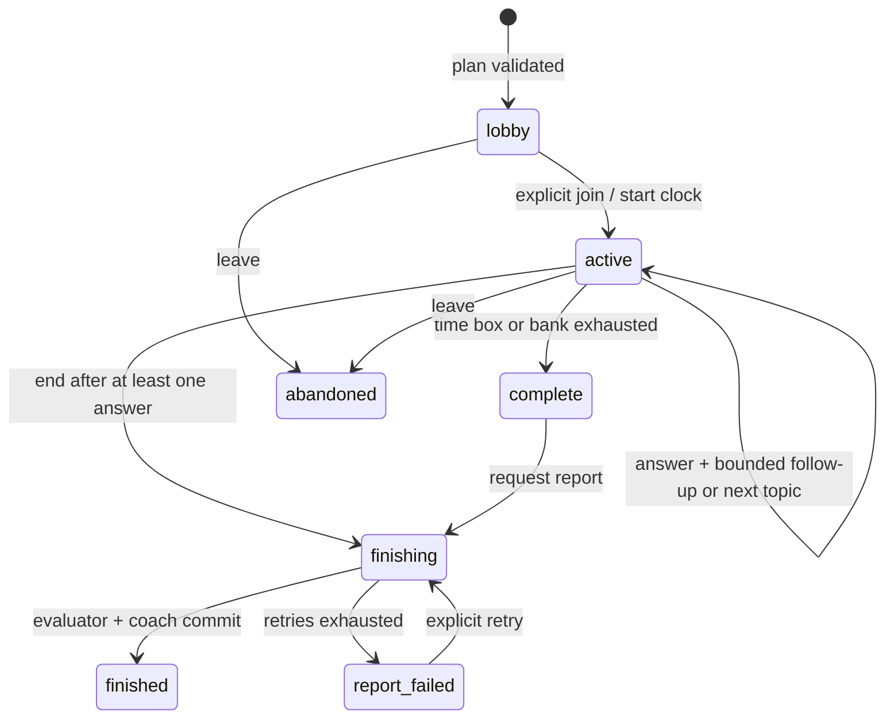

# Agent workflows and state contracts

## Roles and handoffs

| Agent | Input / trusted retrieval | Output contract | Next step |
| --- | --- | --- | --- |
| Resume analyst | Extracted PDF/text (untrusted content) | ResumeDigest | Store private digest |
| Planner | Role, JD, resume snapshot, duration, interview profile | Plan | Create lobby and first question |
| Interviewer | Exact answer, conversation, remaining time, interview profile | InterviewDecision | Service validates memory, bank choice and action |
| Evaluator | Frozen topic evidence, shared brief and public interview profile | TopicAssessment / EvidenceReportSummary | Checkpoint evidence, compute rubric totals and summary |
| Coach | Validated report | SkillCoachingPlan | Persist tasks with report |
| Setup assistant | Role, company context, experience | Titles / JobDescriptionDraft | Save and render an editable role brief |
| Company researcher | Company, role, public URL | CompanyBrief with citations | Save and reuse dated research |

The runtime accepts only registered roles. Prompts are loaded from individual Markdown files;
SHA-256 content prefixes are recorded with every execution. Model output passes a strict
Pydantic contract. There are at most two model calls per invocation (retry or explicit fallback),
with role-specific cancellable deadlines and output budgets. See AGENT_RUNTIME.md for exact limits.
Report jobs get at most three transient attempts with a fenced four-minute lease renewed at checkpoints.
Completed topic, summary and coach artifacts survive retries; permanent failures require explicit action.

Job descriptions use the dedicated `job_description.md` prompt under the setup-assistant role.
The strict contract requires a summary, 5–7 responsibilities, 4–6 requirements, optional skills
and early outcomes. The service renders these fields; it cannot accept a four-line generic string.
The prompt calibrates seniority and avoids invented employer claims. Structure is validated in code;
role relevance and technical accuracy still require live-model evaluation and user review.

Normal app usage requires live credentials. Deterministic fixtures are test-only, opt-in and stored
under `tests/fixtures/`. Live calls cannot fall back to these fixtures. Failures remain visible errors.

## Interview personas

`backend/app/personas.py` owns the professional practice roles and their presentation metadata:

| ID | Role | Interview focus |
| --- | --- | --- |
| `recruiter` | Recruiter | Career story, motivation and clear communication |
| `hiring_manager` | Hiring Manager (default) | Relevant experience, ownership, delivery and collaboration |
| `technical` | Technical Interviewer | Applied role skills, trade-offs, testing and failure cases |
| `leadership` | Leadership Interviewer | Judgment, influence, conflict and accountability |

These are AI practice roles. They do not represent real employees or an employer's internal process.
The planner and live interviewer receive the complete server-owned definition, including behavioral
guidance. The evaluator receives its public focus and round so it assesses what was actually asked.
Prompts request concise spoken questions, one at a time, calibrated to experience and domain.

Creation snapshots the definition in the plan's private `_persona` key. Subsequent turns, reports and
UI metadata use that snapshot, so code changes apply to new sessions. API responses expose only the
public `persona_profile`; instructions and private plan metadata stay on the server. Legacy IDs map
as follows: `neutral` and `company` to `hiring_manager`, `friendly` to `recruiter`, and `tough` to
`technical`. Historical rows without a snapshot resolve through this mapping without a data rewrite.
Contract tests cover role propagation, immutable snapshots, legacy reads and invalid inputs; these
checks establish wiring and persistence, not live-model adherence to every behavioral instruction.

## Interview transition diagram

The interviewer proposes follow_up/advance/finish, a short transition, an unvisited topic index and
exact answer excerpts for memory. The service validates all proposals, appends the selected bank question
and allows at most two follow-ups. Finish is eligible in the last three minutes; otherwise coverage continues. With ≤2 minutes remaining,
the next accepted answer closes the session. A two-minute grace allows a final in-flight answer
at the deadline. It does not allow unbounded interviewing after expiry.

## Reliability contracts

- Typed answers are stored exactly after trimming surrounding whitespace. Models cannot rewrite them.
- Audio transcription is a separate step; silence produces no stored answer.
- Successful turn writes atomically update version, answer, next question and idempotent response.
- The browser keeps an unsent WAV/typed answer in memory for retry with its original request ID.
- A report job freezes input and saves a fingerprint. No new answers can race with scoring.
- Every stage checkpoints its validated artifact with a fenced write; retries resume at the failed stage.
- The worker verifies exact nonblank quotes against identified answers. It computes each topic score
  from the snapshotted persona weights and evidence-linked criterion ratings, excluding inapplicable
  criteria; it then computes the overall score and deterministic practice band.
- Report plus coach tasks commit together. Retries cannot create duplicate tasks.
- Error traces record classes, not provider bodies or transcripts.

## Evaluation and limitations

The round-specific rubric is configured and versioned in personas.py. These weights are provisional.
Revision 3 provides evidence-linked criteria, nullable applicability and verbatim communication samples.
It does not infer confidence, accent, body language or audio delivery from text. Revision 2 interviews
keep their historical 3/3/2/2 rubric and output contracts. No completed reports are silently rescored.

The evaluation CLI in backend/evaluations uses twenty synthetic cases, with expected score ranges,
actions, known quote anchors, languages and injection probes. Offline validation spends nothing;
live runs require --live --accept-cost and preserve model/prompt manifests. See RUN.md. Fixture success
proves workflow correctness, not judgment accuracy. Human reviewers must calibrate reference cases,
applicability and weights before claiming validated assessment quality. Do not use private candidate
transcripts for evaluation without consent and anonymization. See ARCHITECTURE_REVIEW.md for findings.
