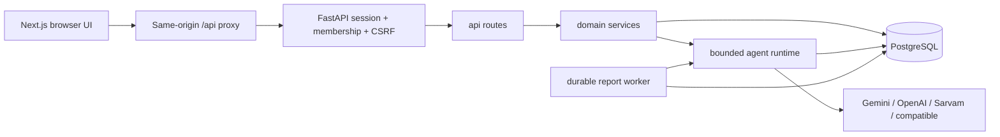

# Architecture

Read this before moving responsibilities across modules. The product serves individual candidates.
Each Google identity has a personal account, private interviews and account-level usage/billing.
The operator assigns models to all seven agent roles in `backend/config/models.toml`.

The database retains its historical `workspaces`/`memberships` names as internal account containers
to preserve existing sessions, history and billing references. Workspace creation, switching,
invitations and provider-preference APIs are removed. Legacy account model preferences are ignored.
Do not reintroduce owner access to another candidate’s interviews or execution traces.

## Request path

The frontend never holds provider credentials. Google signs the identity assertion; a random
opaque cookie references a server-side session and its internal account container. Every private
request rechecks membership, and all candidate resources additionally require matching user ownership.

## Module responsibilities

| Module | Owns | Must not do |
| --- | --- | --- |
| `api/` | HTTP parsing, auth dependencies, response transport | Inline business workflows |
| `services/interviews.py` | Authoritative lifecycle, transcript storage, leases, follow-up policy | Trust model control flow |
| `services/reports.py` | Durable report + coaching pipeline, atomic publication | Hold write locks across inference |
| `agents/runtime.py` | Classified bounded retries/fallback, semantic validation, optional traces | Mutate interview state or authorize users |
| `agents/specs.py` / `context.py` | Immutable execution bundles, shared briefs and bounded context | Store credential values |
| `services/company_research.py` | Bounded search, sourced facts and private cache | Search candidate transcripts |
| `agents/prompts/` | Role instructions and shared untrusted-data preamble | Store secrets or enforce access controls |
| `providers/` | Vendor request/response adaptation | Query tenant data or choose entitlements |
| `models.py` / migrations | Relational schema and history | Return whole private records to clients |
| `schemas.py` | Validated agent/API contracts | Depend on a vendor SDK |
| `frontend/src/lib/api.ts` | Typed browser boundary, session/CSRF handling | Persist credentials in browser storage |
| `AppShell` / `AuthProvider` | Route UX and personal account context | Replace backend authorization |
| `frontend/src/features/interview/` | Device phases, recording cleanup, stable retry requests | Decide authoritative timer, score or interview status |

## Agentic design

This is a bounded agent workflow, not an unconstrained model loop. The planner prepares a bank;
the interviewer proposes a follow-up/advance/finish action; the service enforces the selected
question and two-follow-up limit. The evaluator reviews evidence; the coach turns gaps into
practice tasks. Only validated artifacts cross handoffs. See `AGENT_WORKFLOWS.md`.

No shell, arbitrary HTTP, filesystem, or database tools are exposed to models. Retrieval is
performed by trusted application services with a account/candidate scope. This gives agents
useful context without giving candidate text authority over the application.

## Persistence and concurrency

PostgreSQL is the production database. SQLite is a convenient local/test option. Alembic owns
schema creation. Interview turns are relational; bounded plans/reports are JSON artifacts.
A turn requires the version the browser saw plus a unique request ID. A database compare-and-swap
claims a short lease, inference runs outside the transaction, and the final write checks the
lease token and version. Duplicate completed requests return the stored response.

Reports are queued in the same transaction that freezes the interview. Workers claim jobs with
a database lease. The report and practice tasks become visible together; a stale worker cannot
commit after another worker claims its lease. There is no dependency on process-local locks,
an in-memory queue, or a browser remaining connected.

## Deliberate choices

- Keep the existing two-language stack rather than introduce another application framework.
- Use a small explicit orchestrator rather than a framework whose hidden state would complicate
  debugging and coding-agent edits. Each agent is a prompt, contract, and invocation.
- Use PostgreSQL as the queue as well as the data store at this scale. Add a broker only when
  throughput measurements justify it; preserve the job/lease contracts.
- Store trace metadata separately from private execution bundles. Prompt versions are retained in
  immutable prompt_bundles referenced from private interview/job snapshots; candidate answers remain in candidate-scoped tables.
- Default to Sarvam cloud speech and automatic microphone turn-taking. Speech credentials,
  models and voice are configured separately from reasoning roles; see `VOICE.md`.
- Treat scores as practice feedback. No claim is made about real hiring probability.

## Current execution contracts

See [AGENT_RUNTIME.md](AGENT_RUNTIME.md) for immutable model/prompt bundles, role budgets, context
selection, evidence validation and checkpoint recovery. [COMPANY_RESEARCH.md](COMPANY_RESEARCH.md)
describes setup-time Google Search grounding and citation handling. Neither models nor retrieved
web text can authorize a write or alter the scoring contract.

## Consented recruiter access

Candidates may now explicitly publish a discovery profile. Recruiters use the same Google identity
system with a separate onboarding profile and UI. `services/discovery.py` is the only boundary for
cross-account resume access: candidate-approved, pinned to a selected resume and checked on every
read. This is not workspace/team access; private interviews, agent traces and reports remain
creator-only. See [SURI_INTEGRATION.md](SURI_INTEGRATION.md) for the state machine and feature map.
